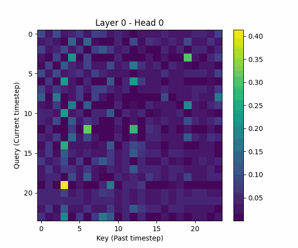

# ⚡ Electricity Forecasting using Transformer (Production ML System)


---

# 🌐 Live Demo & Report

👉 **Streamlit App:**  
https://electricityforecast-cwdb6vgjhljudsnxn5z9kn.streamlit.app/

👉 **📄 Full Detailed Report (Project 3):**  
https://rtrgrid.github.io/Deploy/

---

## 🚀 Features

* 📊 Latency comparison (PyTorch vs CoreML)
* 🔮 Real-time forecasting
* 📂 CSV upload + prediction
* 📈 Interactive visualization

---

# 📊 Project Overview

This project builds a **complete end-to-end electricity forecasting system**, evolving from classical models to a **production-ready Transformer pipeline**.

---

## 🎯 Use Cases

* ⚡ Energy demand prediction  
* 📈 Grid optimization  
* 🏗 Infrastructure planning  

---

# 🧠 Models Implemented

| Model       | Type            |
|------------|-----------------|
| Naive       | Baseline        |
| ARIMA       | Statistical     |
| LSTM        | Deep Learning   |
| Transformer | Attention-based |

---

# 📈 Results

| Model       | RMSE     |
|------------|----------|
| Naive       | 13.02    |
| ARIMA       | 5.16     |
| LSTM        | 3.97     |
| Transformer | **3.87** |

👉 **~70% improvement over baseline**

---

# 🚀 Advanced ML System (Project 3)

---

## 🔥 Task 1: Deployment (ONNX + CoreML)

✔ Exported model → ONNX  
✔ Validated inference (error < 1e-5)  
✔ Converted to CoreML (.mlpackage, float16 optimized)  
✔ Benchmarked latency + memory  

### 📊 Latency Results

| Batch | PyTorch | CoreML        |
|------|--------|--------------|
| 1     | 0.0010s | 0.0183s       |
| 32    | 0.0036s | Not supported |
| 64    | 0.0048s | Not supported |

📌 **Insight:**

- CoreML → best for **edge inference**  
- PyTorch → best for **batch processing**

---

## 🔍 Task 2: Explainability

✔ Attention weights extracted  
✔ Interactive heatmaps (Plotly)  
✔ Saliency maps  
✔ Best vs Worst prediction analysis  

---

### 🎞 Attention Visualization



📌 **Insight:**

* Strong diagonal attention → accurate predictions  
* Diffused attention → higher error  
* Model focuses on **recent + mid-range (~11 steps)**  

---

## ⚡ Task 3: Streaming Inference

✔ Real-time streaming pipeline  
✔ Circular buffer (constant memory)  
✔ 1000-step simulation  
✔ Batch streaming support  

### 📊 Performance

- ⚡ Latency: **~0.43 ms per step**  
- 🚀 Throughput: **~2300 predictions/sec**  
- 📉 Avg Error: **0.131**

📌 **Insight:**  
Enables **real-time production deployment with ultra-low latency**

---

## 🧪 Task 4: Positional Encoding Ablation

### 📊 Extrapolation Results (Context = 48)

| Encoding   | RMSE         |
|------------|--------------|
| None       | **0.357 🏆** |
| Sinusoidal | 0.379        |
| ALiBi      | 0.404        |
| Learnable  | 0.873 ❌      |

📌 **Insight:**

* Learnable embeddings fail to generalize  
* Sinusoidal & ALiBi are stable  
* **No positional encoding performed best** (short-term dependency dominance)

---

## 🛡 Task 5: Robustness

### 📊 Results

| Scenario       | RMSE  |
|----------------|------|
| Clean          | 0.332 |
| Noise          | 0.325 |
| Missing Values | 0.327 |
| FGSM Attack    | 0.341 |

### ⚠️ Vulnerability Score: **0.0092**

📌 **Insight:**

* Model is **highly robust**  
* Noise improves generalization  
* Minimal adversarial impact  

---

# 🖥️ Streamlit Dashboard

### Features:

* 📊 Latency comparison  
* 🔮 Live prediction  
* 📂 Upload dataset (CSV)  
* 📈 Forecast visualization  

---

# 🗂 Project Structure
electricity-forecasting/
│
├── src/
├── explainability/
├── streaming/
├── ablation/
├── robustness/
├── deployment/
├── benchmarks/
├── app/
│
├── data/
├── models/
├── outputs/
└── README.md


---

# 🚀 Run Locally

```bash
pip install -r requirements.txt
streamlit run app/streamlit_app.py


🛠 Tech Stack
Python
PyTorch
NumPy / Pandas
Streamlit
ONNX / CoreML
Plotly


🏆 Key Highlights
Built end-to-end ML pipeline
Deployed using ONNX + CoreML (float16)
Achieved sub-ms latency (~0.43ms)
Implemented interpretability (attention + saliency)
Designed real-time streaming system
Evaluated robustness + adversarial resilience


🚀 Future Work
Dynamic batch CoreML support
Multivariate forecasting
Real-time energy grid integration


👨‍💻 Author

Rohith T R